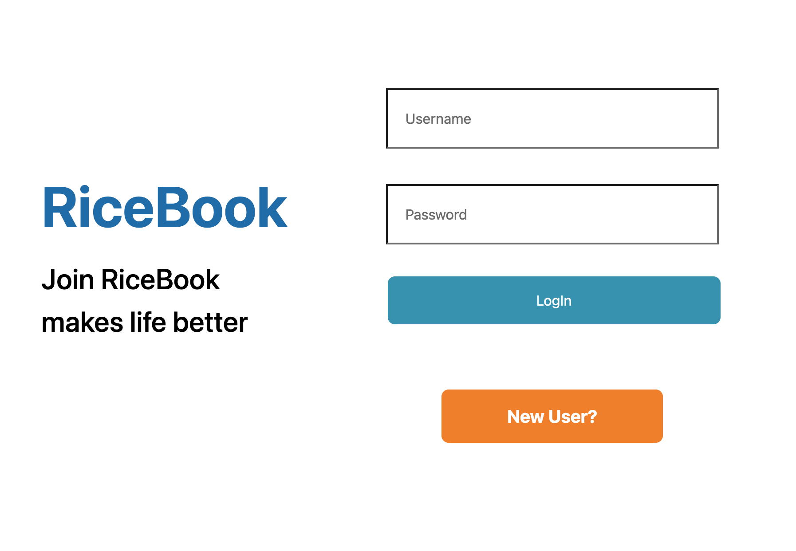
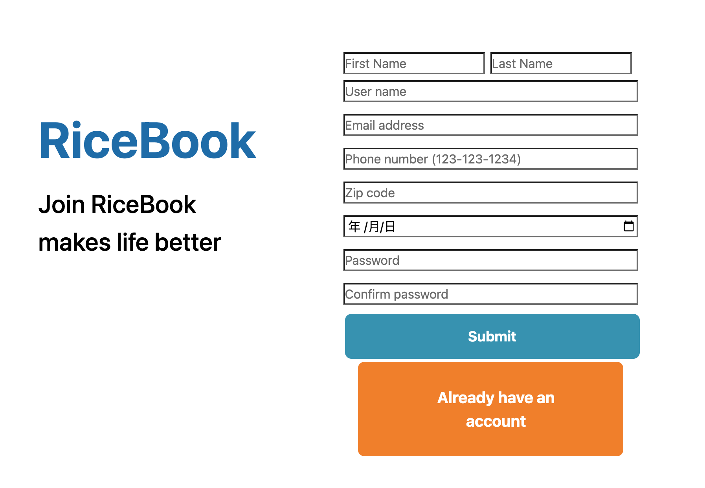
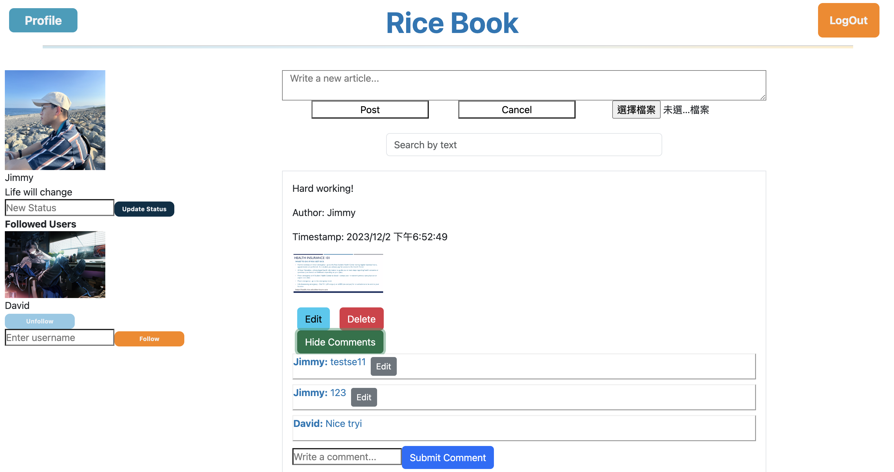
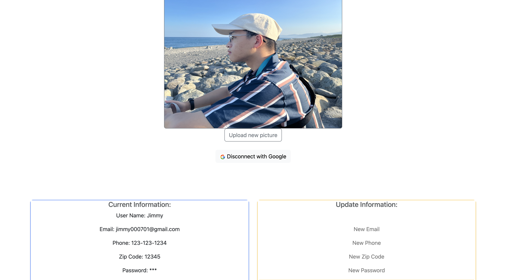

## Slip days

1. First used: 12/2 (Saturday)
   - Finish Google OAuth and deployment

## Project information

"netid": "jc272",  
"frontend": "https://finalwebjc272.surge.sh",  
"backend": "https://ricebooksocial-db8feb863190.herokuapp.com",

## User test information

- User 1:
  - Username: Jimmy
  - Password: 123
  - Connect with Google
- User 2:
  - Username: David
  - Password: 123
  - Not Connect with Google yet

### Login page

### Register page

### Main page

### Profile page

### Heroku command

- heroku apps:info
