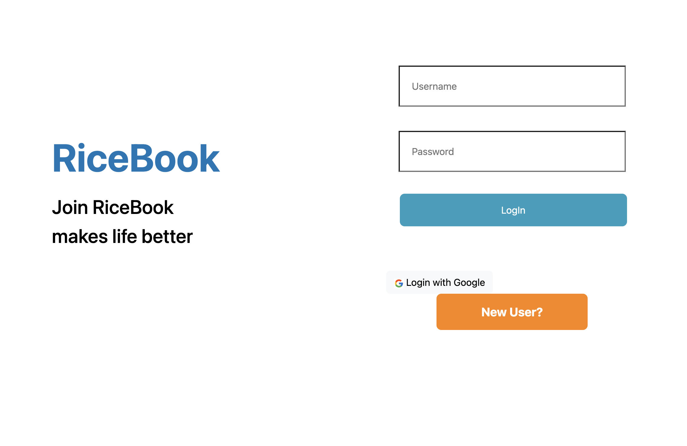

"netid": "jc272",  
"frontend": "https://jc272-hw6.surge.sh/",  
"backend": "https://jc272ricebook-de07b8f7e03a.herokuapp.com"

### Unit test result

### Login page

### Register page

### Main page

Use placeholder to login

- Username: Bret
- Password: Kulas Light
  

### Profile page

### Heroku command

- heroku apps:info
